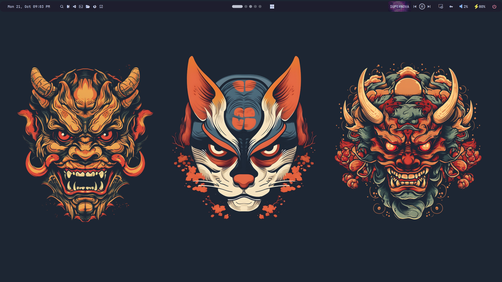
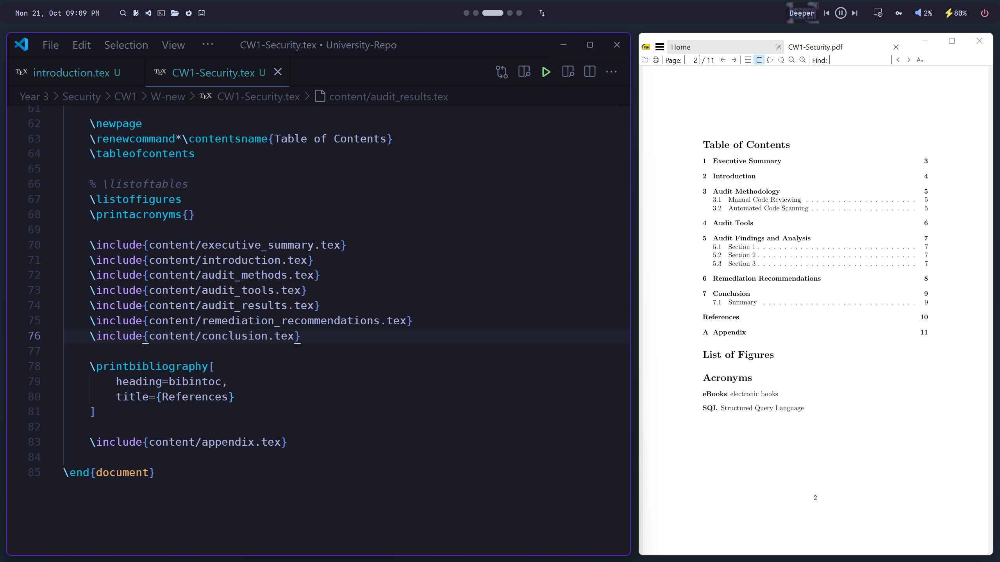
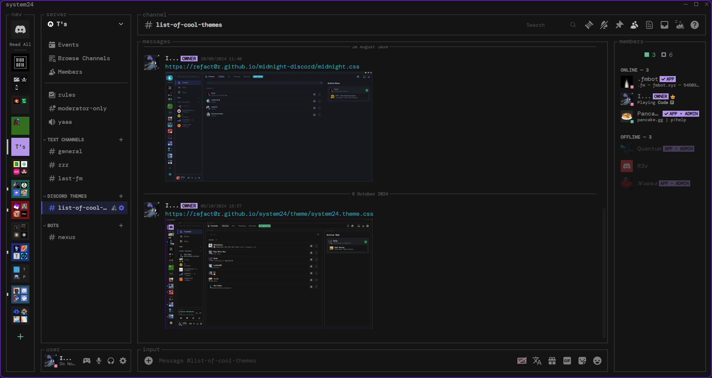
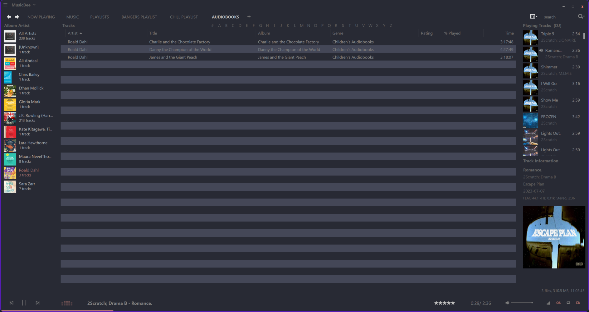
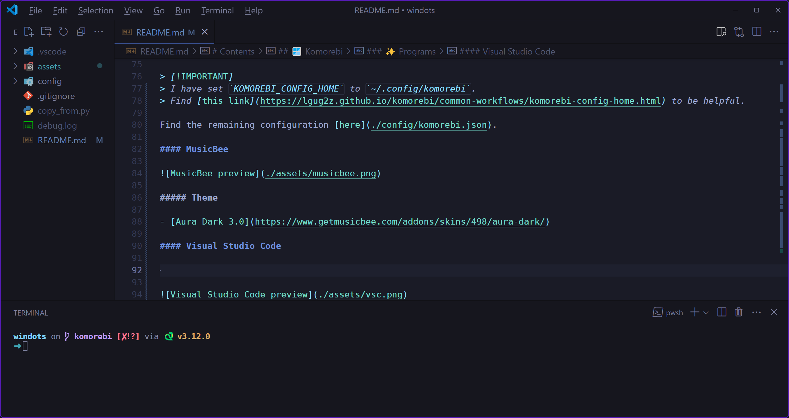
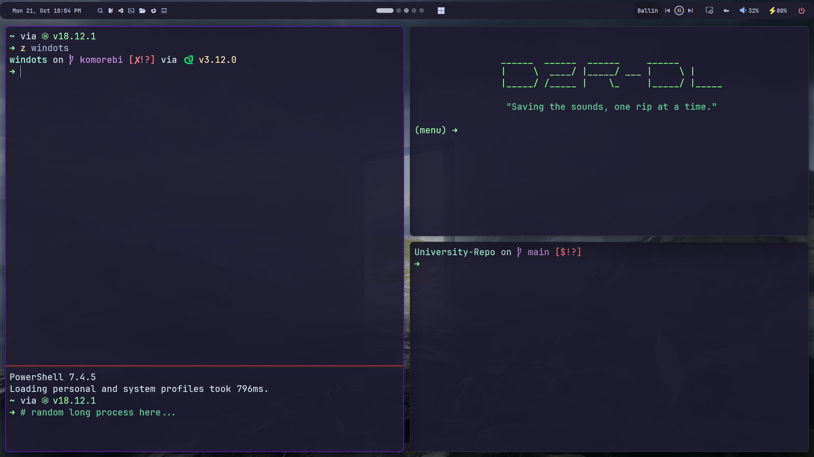
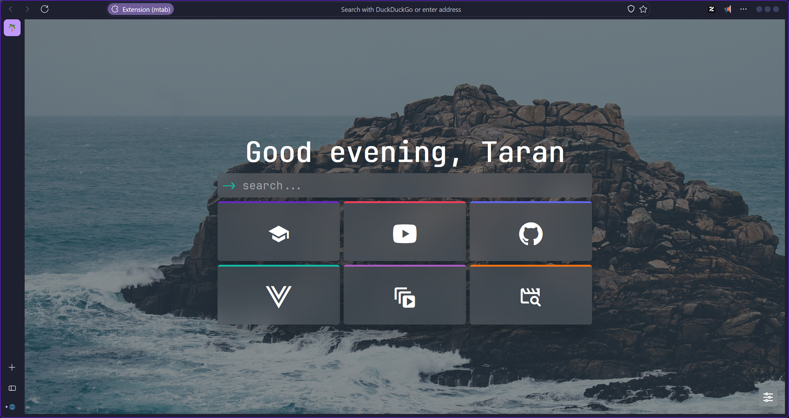

# Taran's windots

Hello! Welcome to the `komorebi` branch of my Windows config that's being used daily. I like to have a clean and minimal desktop instead of bloat everywhere. I like Linux but University requires Windows, so here I am.

> [!IMPORTANT]
> Moved `Backgrounds` to it's own repo:
> https://github.com/tarannagra/Wallpapers

# Contents

- [Taran's windots](#tarans-windots)
- [Contents](#contents)
  - [🪟 Komorebi](#-komorebi)
    - [📸 Showcase](#-showcase)
      - [🖥️ Desktop](#️-desktop)
      - [👨‍💻 Workflow](#-workflow)
    - [✨ Programs](#-programs)
      - [ButteryTaskbar2](#butterytaskbar2)
      - [Discord (Running Vencord)](#discord-running-vencord)
        - [Online Themes](#online-themes)
        - [Plugins](#plugins)
      - [Komorebi](#komorebi)
      - [MusicBee](#musicbee)
        - [Theme](#theme)
      - [Visual Studio Code](#visual-studio-code)
        - [Theme](#theme-1)
      - [Windows Terminal](#windows-terminal)
        - [Settings](#settings)
      - [YASB Reborn](#yasb-reborn)
      - [Zen Browser](#zen-browser)
        - [Mods](#mods)
- [⭐ Ending notes](#-ending-notes)

## 🪟 Komorebi

I like Komorebi, it's different and it's got cool animations.

### 📸 Showcase

#### 🖥️ Desktop



#### 👨‍💻 Workflow



### ✨ Programs

- [ButteryTaskbar2](https://github.com/LuisThiamNye/ButteryTaskbar2)
- [Discord (Running Vencord)](https://github.com/Vendicated/Vencord)
- [Komorebi](https://github.com/LGUG2Z/komorebi)
- [MusicBee](https://getmusicbee.com/)
- [Visual Studio Code](https://code.visualstudio.com/)
- [Windows Terminal](https://github.com/microsoft/terminal)
- [YASB Reborn](https://github.com/amnweb/yasb)
- [Zen Browser](https://github.com/zen-browser/desktop)

#### ButteryTaskbar2

Settings are defaulted. Ensure that it's ran on startup.

#### Discord (Running Vencord)



##### Online Themes

```
https://discord-extensions.github.io/modern-indicators/src/source.css
https://raw.githubusercontent.com/SL4F/vencord/main/themes/SettingsModal/SettingsModal.theme.css
https://refact0r.github.io/system24/theme/system24.theme.css
https://raw.githubusercontent.com/KrstlSkll69/vc-snippets/main/OtherStuff/hideGlobalDiscovery.css
```

##### Plugins

Only showing plugins that're *not* built-in:

- [SoundBoardLogger](https://github.com/ImpishMoxxie/SoundBoardLogger)
- [vc-message-logger-enhanced](https://github.com/Syncxv/vc-message-logger-enhanced)
- [vencord-base64-decoder](https://github.com/ThePirateStoner/vencord-base64-decoder)

#### Komorebi

> [!IMPORTANT]
> I have set `KOMOREBI_CONFIG_HOME` to `~/.config/komorebi`.
> Find [this link](https://lgug2z.github.io/komorebi/common-workflows/komorebi-config-home.html) to be helpful.

Find the remaining configuration [here](./config/.config/komorebi/komorebi.json).

#### MusicBee



##### Theme

- [Aura Dark 3.0](https://www.getmusicbee.com/addons/skins/498/aura-dark/)

#### Visual Studio Code



##### Theme

- Tokyo Night

#### Windows Terminal



I have modified this to be able to replicate my [wezterm config](./config/.wezterm.lua).

##### Settings

- [PowerShell](https://github.com/PowerShell/PowerShell) & Modules:
  - Terminal-Icons
  - z
- [Starship](https://starship.rs/)

#### YASB Reborn

This is the bar along the top of each image where visible.

Install the bar at [this link](https://github.com/amnweb/yasb), enable startup & copy the `config.yaml` & `styles.css` into `~/.config/yasb/`.

#### Zen Browser



##### Mods

To install mods, go to [this link](https://zen-browser.app/mods) & press install on any you find cool.

- Audio TabIcon Plus
- Better UniExtBtn
- Better Unloaded Tabs
- Cleaner Extension Menu
- Disable Rounded Corners
- Floating findbar
- Floating URLbar
- Minimal sidebar
- No Sidebar Scrollbar
- Private Mode Highlighting
- Smaller Compact Mode
- Super URL Bar
- Tokyo Night Moon (this one is the theme)
- Uniform Workspaces Button
- Zen Minimal Exit Menu

# ⭐ Ending notes

If you have found this useful or have taken anything here, I would appreciate a star on here ⭐
