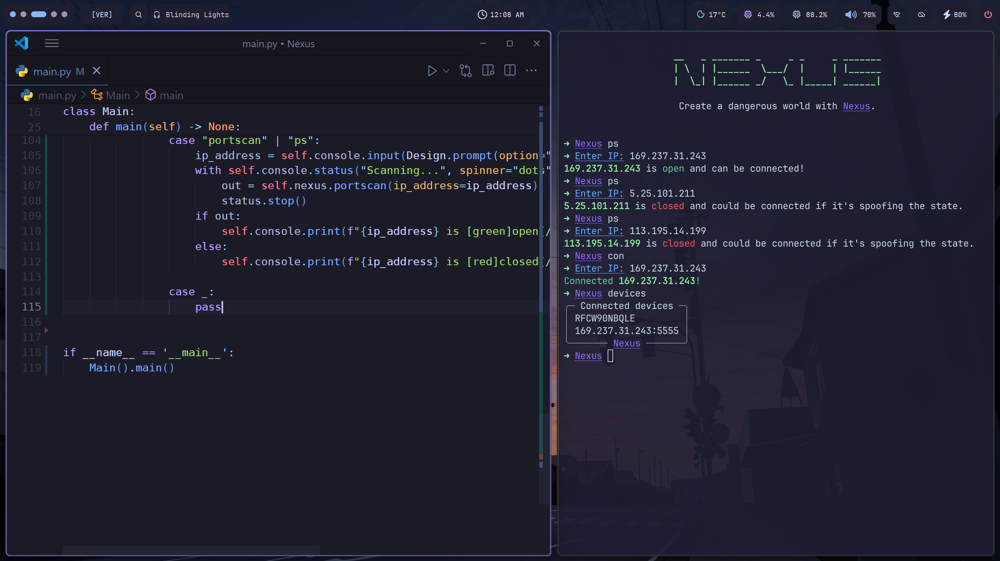

# Taran's windots

Hello! Welcome to the showcase of my Windows dotfiles (windots) that I use daily. I prefer the clean and minimal type of desktops and have created this thus far.

# Contents

- [Taran's windots](#tarans-windots)
- [Contents](#contents)
  - [🪟 Komorebi](#-komorebi)
    - [📸 Showcase](#-showcase)
      - [🖥️ Desktop](#️-desktop)
      - [👨‍💻 Workflow](#-workflow)
    - [✨ Features](#-features)
    - [⬇️ Installing Komorebi](#️-installing-komorebi)
    - [⬇️ Installing the bar](#️-installing-the-bar)
- [⭐ Ending notes](#-ending-notes)

## 🪟 Komorebi

I plan to test out using this other window manager and an entirely new status bar rather than relying on using Glaze - not bad-mouthing Glaze, but it's good to scour the internet and find another cool piece of software :D.

### 📸 Showcase

#### 🖥️ Desktop


#### 👨‍💻 Workflow



### ✨ Features

- A clean bar, courtesy of this [fork](https://github.com/ashwinjadhav818/yasb/) of the Yasb bar (with some small mods of my own)
- Komorebi workspaces and animations :D
- A nice WezTerm config that also removes the title bar
- [Flow Launcher](https://flowlauncher.com) with a nice glass acrylic effect on it
- On the bar specifically, it can do the following:
  - Detect the current Komorebi workspace
  - Change the tiling direction 
  - On the left click, you can search using Flow Launcher & on the right it changes wallpaper using a program I re-wrote in Rust for more speed.
  - A working media displayer which, when pressed shows off the artist. Only shows the title without any clicks.
    - [ ] TODO: add callbacks for play/pause on left/right clicks.
  - A clock in the middle and a left-click shows the date in DD:MM:YY format.
  - Displays the weather and left-clicking displays more information if needed.
  - CPU & RAM in their respective slots with CPU showing the core count on the left while RAM shows the available RAM free.
  - Volume meter to display the current volume and left-clicking toggles the volume to a muted state.
  - Wi-Fi symbol to determine Wi-Fi status.
    - [ ] TODO: Add ethernet with Wi-Fi in the same provider.
  - Custom widget to toggle Cloudflare Warp. You can remove this.
  - Battery widget with a left-click that displays the ETA left.
  - Finally, a custom power menu (not made by me, but it's awesome).

### ⬇️ Installing Komorebi

Using WinGet:

```cmd
winget install LGUG2Z.komorebi
winget install LGUG2Z.whkd
```

### ⬇️ Installing the bar

For my desktop, I used [this bar](https:://github.com/ashwinjadhav818/yasb/) and gave it some modifications. I prefer a clean and minimal bar that displays all I need to know daily. 

There's not too much of a difference but for some of the widgets there are differences and I have added 2x custom ones. On the README within the repository, there are install instructions and a note to add it to start-up... which is recommended!

> [!IMPORTANT]
> When the bar has been installed. In your taskbar, there will be a Y logo for the Yasb bar. Right click it and make sure you enable "Enable Autostart", then you won't have to create a startup script yourself and do all that mumbo jumbo stuff.


# ⭐ Ending notes

If you have found this useful or have taken anything here, I would appreciate a star on here ⭐