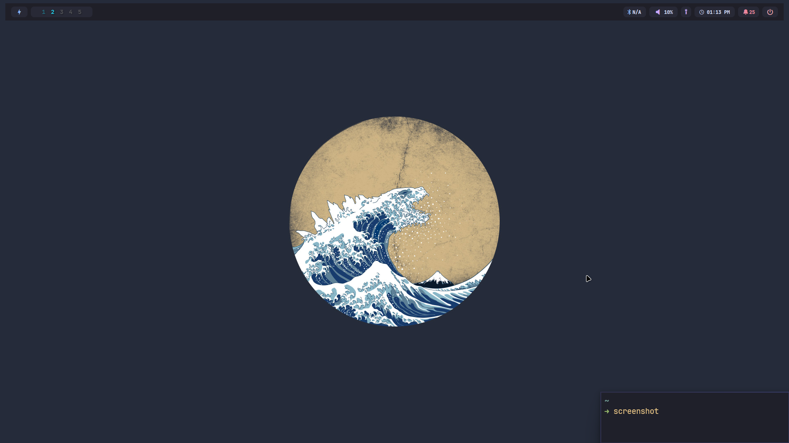

# Taran's windots - Komorebi Edition :D

> [!WARNING]
> This is unmaintained. I no longer use Windows as any of my operating systems.

Hello! Welcome to the `komorebi` branch of my Windows config that's being used daily. I love a clean and powerful desktop. As most do, I constantly change, but for the past *five* ish months or so, I've loved the kanagawa colourscheme. So here, I present, my kanagawa based system.

Featured on [awesome komorebi](https://github.com/LGUG2Z/awesome-komorebi)!

## Komorebi & YASB

### 📸 Showcase

#### 🖥️ Desktop

#### 👨‍💻 Workflow

### ⚙️ Software Used 

In no particular order:

- Obsidian
- Neovim
- Komorebi
- YASB Reborn
- OneCommander

# ⭐ Ending notes

If you have found this useful or have taken anything here, I would appreciate a star on here ⭐
