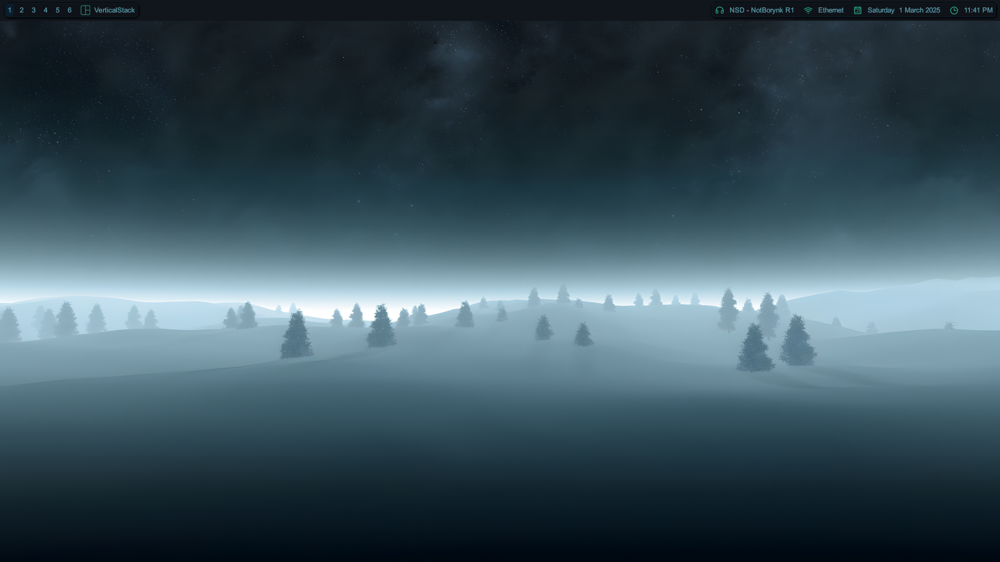
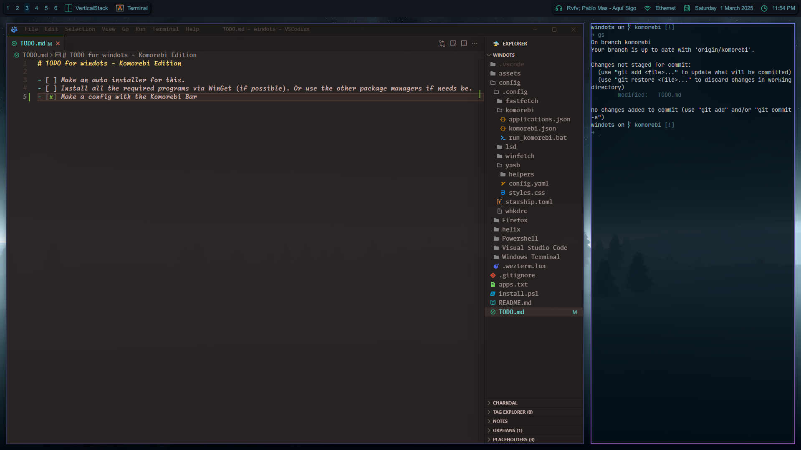

# Taran's windots - Komorebi Edition :D

Hello! Welcome to the `komorebi` branch of my Windows config that's being used daily. I like to have a clean and minimal desktop instead of bloat everywhere. I prefer Linux, but I for some reason keep Windows installed.

Featured on [awesome komorebi](https://github.com/LGUG2Z/awesome-komorebi)!

# ‼️ Refactoring this README


## ✅ Current Workflow w/ KomoEverything

### 📸 Showcase

#### 🖥️ Desktop



#### 👨‍💻 Workflow



### ✨ Programs

- [Komorebi](https://github.com/LGUG2Z/komorebi)
- [Masir](https://github.com/LGUG2Z/masir)
- [Vesktop](https://github.com/Vencord/Vesktop)
- [VSCodium](https://vscodium.com/)
- Notify - custom notify program, located [here](./config/.config/notifications/notify.py).


## ⚠️ Legacy Workflow w/ Komorebi & YASB

<details>

<summary>Old Workflow w/ Komorebi & YASB</summary>

### 📸 Showcase

#### 🖥️ Desktop


#### 👨‍💻 Workflow


### ✨ Programs

- [ButteryTaskbar2](https://github.com/LuisThiamNye/ButteryTaskbar2)
- [Firefox](https://www.mozilla.org/en-GB/firefox/new/)
- [Komorebi](https://github.com/LGUG2Z/komorebi)
- [MusicBee](https://getmusicbee.com/)
- [VSCodium](https://vscodium.com/)
- [Windows Terminal](https://github.com/microsoft/terminal)
- [Vesktop](https://github.com/Vencord/Vesktop)

##### Online Themes

```
https://discord-extensions.github.io/modern-indicators/src/source.css
https://raw.githubusercontent.com/SL4F/vencord/main/themes/SettingsModal/SettingsModal.theme.css
https://refact0r.github.io/system24/theme/system24.theme.css
https://raw.githubusercontent.com/KrstlSkll69/vc-snippets/main/OtherStuff/hideGlobalDiscovery.css
```

#### Komorebi

> [!IMPORTANT]
> I have set `KOMOREBI_CONFIG_HOME` to `~/.config/komorebi`.
> Find [this link](https://lgug2z.github.io/komorebi/common-workflows/komorebi-config-home.html) to be helpful.

Find the remaining configuration [here](./config/.config/komorebi/komorebi.json).

#### MusicBee


> [!IMPORTANT] 
> A hacky fix for MusicBee and YASB.
> Find [this repository](https://github.com/HenryPDT/mb_MediaControl) to be helpful.
> This is a hacky workaround so be cautious when using it.

##### Theme

- [Aura Dark 3.0](https://www.getmusicbee.com/addons/skins/498/aura-dark/)

#### VSCodium


For using VSCodium, place [product.json](./config/Visual%20Studio%20Code/product.json) in:

- `%APPDATA%/VSCodium/`

Please note that the yellow border around the window is managed by [komorebi](#komorebi).

##### Configuration

I have followed a tutorial online to heavily customise my user interface, font family and more. You can find my configuration [here](./config/Visual%20Studio%20Code/settings.json).

#### YASB Reborn

This is the bar along the top of each image where visible.

Install the bar at [this link](https://github.com/amnweb/yasb), enable startup & copy the `config.yaml` & `styles.css` into `~/.config/yasb/`.

</details>

# ⭐ Ending notes

If you have found this useful or have taken anything here, I would appreciate a star on here ⭐
