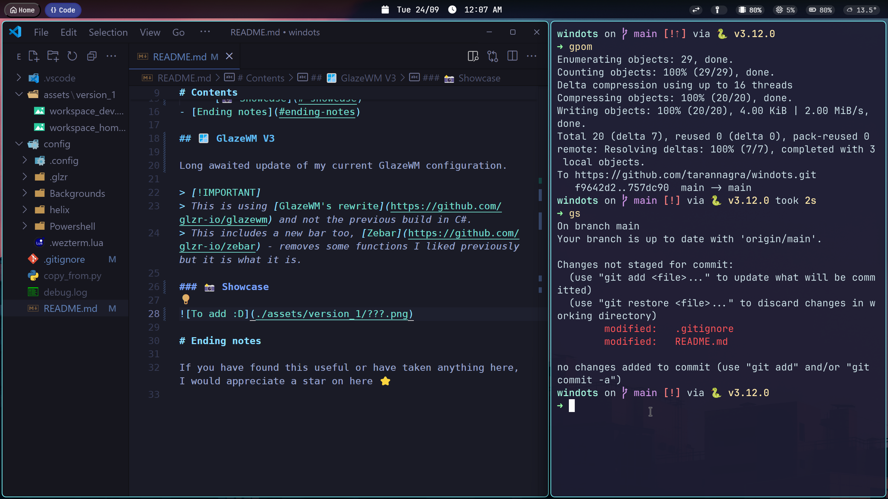
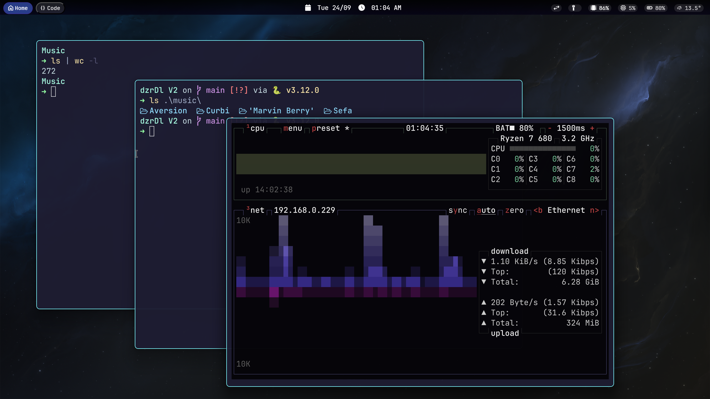
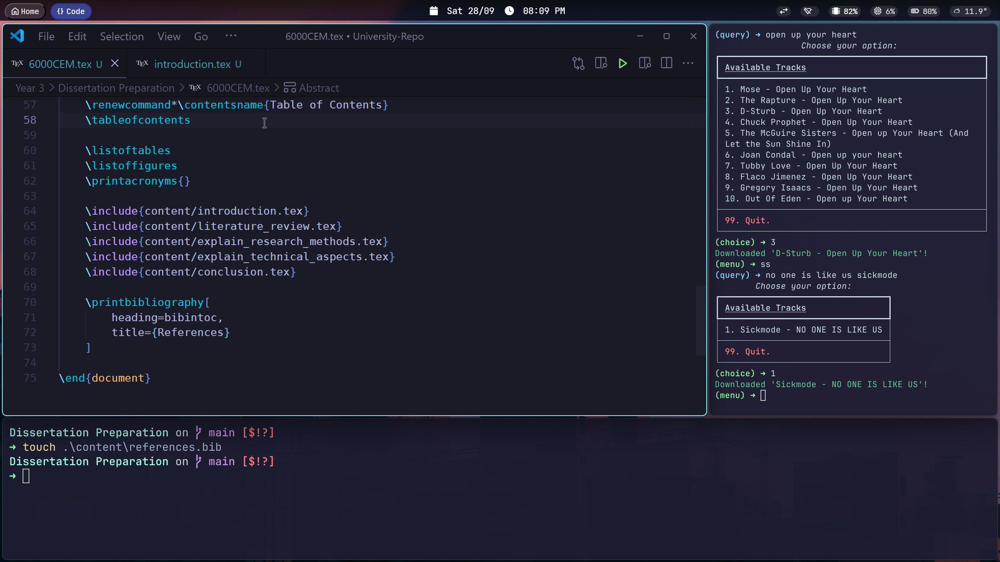

# Taran's windots

> [!WARNING]
> This is unmaintained. I no longer use Windows as any of my operating systems.

Hello! Welcome to the showcase of my Windows dotfiles (windots) that I use daily. I prefer the clean and minimal type of desktops and have created this thus far.

# Important

I have another branch with content related to Komorebi instead of GlazeWM. You can find it by changing brances, or by [pressing me](https://github.com/tarannagra/windots/tree/komorebi)!

# Contents

- [Taran's windots](#tarans-windots)
- [Important](#important)
- [Contents](#contents)
  - [🪟 GlazeWM V3](#-glazewm-v3)
    - [📸 Showcase](#-showcase)
    - [🧰 Tools I Use](#-tools-i-use)
- [Ending notes](#ending-notes)

## 🪟 GlazeWM V3

Long awaited update of my current GlazeWM configuration.

> [!IMPORTANT]
> This is using [GlazeWM's rewrite](https://github.com/glzr-io/glazewm) and not the previous build in C#.
> This includes a new bar too, [Zebar](https://github.com/glzr-io/zebar) - removes some functions I liked previously but it is what it is.

### 📸 Showcase

### 🧰 Tools I Use

TODO.

# Ending notes

If you have found this useful or have taken anything here, I would appreciate a star on here ⭐
